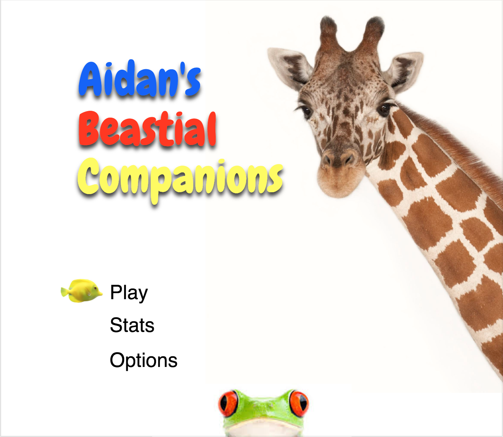

# [Aidan's Beastial Companions (abc-frontend)](https://jufebrown.github.io/abc-frontend)
###A primer game for my son Aidan to learn animal names

----
##Links

This project is deployed on github pages at:
[https://jufebrown.github.io/abc-frontend](https://jufebrown.github.io/abc-frontend)

The back-end api repo is:
[https://github.com/Jufebrown/abc-backend](https://github.com/Jufebrown/abc-backend)

The back-end api is deployed to heroku here:
[https://warm-harbor-25906.herokuapp.com/api/v1](https://warm-harbor-25906.herokuapp.com/api/v1)

----
##About

ABC is a simple game that asks the user to name an animal that starts with a randomly given letter.

The game then takes the answer and checks to see if it starts with the given letter. If the letters match, an http call is made to the "getWord" endpoint of the back-end api. If the word is not found there, another api call is made to the [Global Biodiversity Information Facility api](http://www.gbif.org/developer/species) and any data returned from that call is parsed to see if it matches the user's answer and is indeed an animal.

Authentication is handled with JSON web tokens. A user token is generated on login or registration and is sent with every request to the back-end api.

----
##Moqup

----
##Trello
[https://trello.com/b/5EZ4dsnZ/back-end-capstone](https://trello.com/b/5EZ4dsnZ/back-end-capstone)

----
##Future

This is a short list of future planned features:

* Statistical tracking:
  * Games played
  * Average # of correct answers
  * Comparison of user's average correct answers with all users' average
  * Longest word used

* Friends:
  * An achievement/trophy system that awards beastial friends at specified milestones
  * There will be a separate page to view friends
  *  Possibly add a point/currency system to allow user to purchase habitat items for friends

* Remove or limit ability to use repeat words

* Animations and cosmetic touch-ups

----
##Resources

Great tutorial for using JSON web tokens:
[http://mherman.org/blog/2017/01/05/token-based-authentication-with-angular/#.WRtbfmTyuHo](http://mherman.org/blog/2017/01/05/token-based-authentication-with-angular/#.WRtbfmTyuHo)
